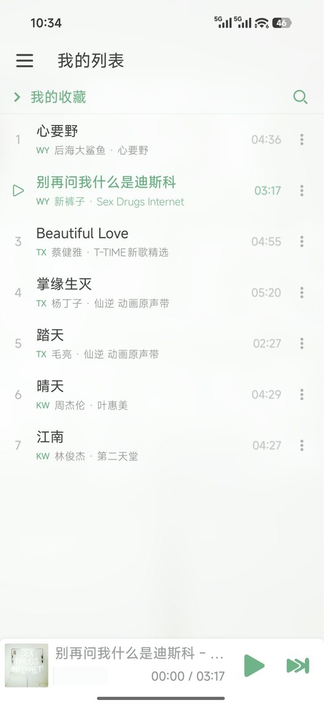
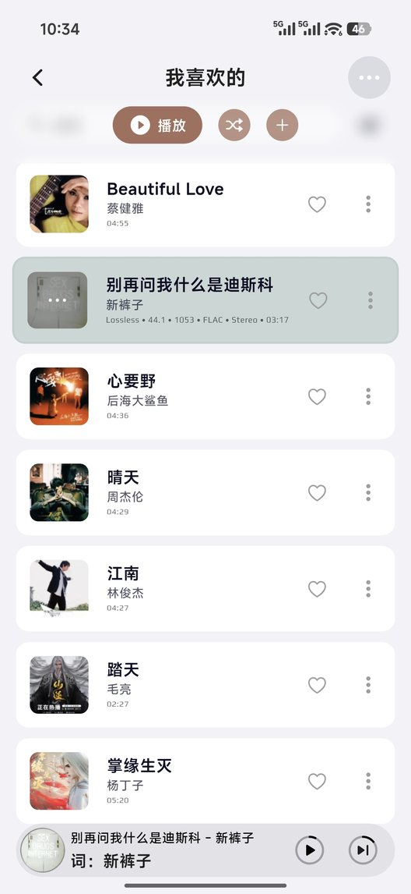

<p align="center"></p>

# SongHamster（音乐仓鼠）— LX 歌单同步入库音乐媒体库

[](https://hub.docker.com/r/libremk66/songhamster)
[](https://hub.docker.com/r/libremk66/songhamster)
[](LICENSE)

将 [LX Music Sync Server](https://github.com/XCQ0607/lxserver) 的歌单（"我喜欢的"、自建歌单）与榜单订阅**自动下载**（完整标签/封面/歌词）并同步进音乐媒体库与播放列表。

支持 **Emby / Navidrome / Jellyfin / 道理鱼 / Subsonic（飞牛等）** 五种媒体服务器，在「连接容器」页用选项卡切换同步目标。

📱 **界面自适应手机 / 平板 / 桌面**：手机上侧栏收进汉堡菜单、底部常驻快捷标签，任务列表的按钮自动改为上下堆叠 —— 躺在沙发上用手机看同步进度、翻历史明细都没问题。

> ⚠️ 本项目只用于同步**你已持有/自有的音乐**。请确保使用合法来源的音乐资源，使用者自行承担相关责任。

> 💡 **这是什么**：SongHamster（音乐仓鼠）是在用上 [lxserver](https://github.com/XCQ0607/lxserver) 之后，为了把歌单**落进 Emby 等媒体库**这个需求、用 AI 搓出来的**自用小工具**——只管"下载完成后怎么整理入库"，不做音源解析、不做播放器。
> 期待 lxserver 将来推出相应的入库功能；在那之前，这个小工具够我自己用，也放出来给有同样需求的人。

## 使用场景

用 [LX Music](https://github.com/lyswhut/lx-music-desktop)（落雪音乐）在**安卓 / 电脑端**听歌收藏 →
数据经 **LX Sync Server**（lxserver）同步 →
本项目把你在落雪里收藏/建立的歌单**自动下载并同步进你的音乐媒体库** →
用媒体服务器**统一管理自建音乐库**。

```
落雪音乐（安卓/桌面）听歌、收藏歌单
        │
        │  歌单数据同步
        ▼
LX Sync Server（歌单数据同步服务 · 下载引擎）
        │
        │  SongHamster 拉取歌单 / 榜单 → 调 lxserver 下载（标签 / 封面 / 歌词）
        │                            → 校验 / 重命名 / 移动文件
        ▼
本项目 SongHamster（同步调度 / 监听新歌单 / 榜单订阅 / 整理入库）
        │
        │  调媒体服务器接口：入库 + 维护播放列表
        ▼
媒体服务器（Emby / Navidrome / Jellyfin / 道理鱼 / Subsonic）
        └─ 自建音乐库 + 播放列表
```

一句话：**在落雪里"喜欢"的每首歌，最终都会以无损 + 完整标签的形式出现在你的音乐库里。**

<table align="center"><tr>
<td></td>
<td></td>
<td></td>
</tr></table>

<p align="center"><sub>左边：落雪音乐安卓端「我的收藏」的 7 首　→　右边：全部自动下载并同步进音乐库的「我喜欢的」<br>
（右边是「<b>箭头音乐</b>」客户端连上媒体服务器后的样子——能连 Emby / 飞牛等服务；<br>
歌曲一首不少，封面 / 歌手 / 专辑 / 歌词等标签齐全，文件是无损 FLAC；两边排序方式不同，故顺序不一致）</sub></p>

## 功能一览

- **歌单同步**：增量（只增不减）/ 镜像（增删同步、向 LX 看齐）两种模式；每歌单独立 cron 定时；全局单飞 + 批量下载保护（请求节流）防音源限流
- **LX 端删除的三级处理**（镜像模式）：① 仅从歌单移除、保留文件（默认）② 移除 + 删除文件（先进回收站可恢复）③ 移入归档歌单（统一归档 / 按来源 `[歌单名]归档` / 任选已有歌单）
- **监听同步**：LX 出现新歌单自动建任务并同步 —— 完全模式（可勾选是否纳入现有歌单，含基线快照 + 忽略列表防循环）或条件模式（按歌单名/关键词规则命中）
- **榜单订阅**：订阅 QQ/酷我/网易云/酷狗/咪咕/百度 榜单，定时拉榜 → 新上榜自动下载入播放列表；可选镜像跟随榜单（跌出即按同一套三级策略处理）
- **音质链**：128k → 192k → 320k → FLAC → FLAC 24-Bit → Hi-Res → Atmos → Atmos Plus → 臻品母带（9 档勾选，按歌曲实际可用档自动尝试；真实位深/采样率/码率实测校验防虚标，Atmos 容器嗅探防换壳）
- **进度与历史**：实时进度显示"第几首/共几首 · 当前阶段 · 当前歌曲 · 成败计数"；历史按 歌单同步 / 榜单订阅 分标签，批次可展开明细、失败可重试
- **日志**：按天落盘 `data/logs/`，界面支持级别筛选（INFO/WARN/ERROR）与关键字搜索
- **手动删除**：任务列表 / 进度历史两处，用复选框自选连带清理 **文件 / 歌单内容 / 历史记录**（删文件才触发重下，删历史只是清账）
- **通知**：同步跑完 / 出错时推一条到 **飞书 · Bark · Server酱 · 自定义 Webhook**；**每个渠道自己选订阅哪些事件**（比如"失败推手机、成功只发群里"）；发送失败只记日志，不影响同步
- **移动端可用**：同一套界面自适应窄屏 —— 侧栏收进汉堡菜单 + 底部快捷标签，表格里的按钮自动堆叠；手机浏览器打开即用，无需另装 App
- **删除安全缓冲（回收站）**：删除 = 先移入 `<downloadRoot>/.songhamster-trash` 可恢复，**彻底删除**才物理删文件
- **安全默认**：源歌单/榜单拉取异常（而非真空）时**停用任务并告警，绝不清空目标**；归档目标被删则降级为"保留文件"，不静默重建
- **账号认证**：登录保护，scrypt 密码哈希，持久会话
- **曲库管理（界面暂时收起）**：安全洗版 / 查重清理 —— 代码与路由保留，需要时一行注解恢复

## 界面

| 页面 | 作用 |
|---|---|
| 连接容器 | LX 下载源 + 媒体服务器（选项卡切换类型；「确定」= 保存 → 测连接 → 探测媒体库 → 全部通过才设为同步目标） |
| 歌单同步 | 两标签：创建同步任务 / 监听同步；下方任务表（模式、删除策略、归档目标、cron、启停） |
| 榜单订阅 | 榜单浏览 + 新建订阅 + 订阅列表（模式与跌出处理可在行内编辑） |
| 下载选项 | 音质偏好 / 文件命名 / 写入文件信息 / 下载行为 / 批量下载保护 |
| 进度历史 | 顶部实时进度 + 歌单同步 / 榜单订阅历史标签（榜单批次标题行带 `🏆 本期 N 首 · 🆕 新上榜 · 🔻 跌出`）（可勾选批次或单曲批量删除）+ 回收站；批次展开后每首歌都有**处理过程**（查库 / 解析直链 / 下载收录 / 入库 / 加入或新建歌单逐条列出） |
| 日志 | 落盘日志，级别筛选 + 关键字搜索 |
| 设置 | 通用（日志保留天数）、账号安全、运行信息 |

## 目录结构

```
data/config.yaml      配置（界面设置保存于此，含密钥，勿提交）
data/songhamster.db     SQLite 数据库（历史/状态/会话）
src/                  源码（Node.js ≥22 + TypeScript，前端 htmx 无构建）
static/               自绘图标与前端静态资源
Dockerfile            多阶段构建镜像（node:22-slim 运行）
config.example.yaml   配置模板（带注释，不含密钥）
docs/                 部署指南（路径映射详解 / 同步重设计规格 / UI 规范）
docs/screenshots/     README 里的界面截图（落雪端 → 媒体库端对照）
docs/icon/            项目图标源文件（各尺寸 PNG，界面/README/favicon 从这里出）
docs/release.md       发版流程与多架构构建备忘（维护者用：标签策略 / 代理坑 / 失败对策）
data/logs/            按天落盘的运行日志（界面「日志」页数据源）
docker-compose.example.yml  部署路径约定模板
```

## 快速开始（Docker 部署）

镜像：**`libremk66/songhamster:latest`**（Docker Hub，多架构 `linux/amd64` + `linux/arm64`，拉取时自动匹配）。运行目录 `/app`，配置与数据库在 `/app/data`（首次启动自动生成默认 config.yaml）。


> ☝️ 三方（lxserver / 媒体服务器 / SongHamster）**共享同一个音乐目录**，只是各容器看到的路径名不同；
> 「连接容器」页两个路径字段该填哪个视角、三个常见坑，都在图里。完整部署说明见 [docs/path-mapping.md](docs/path-mapping.md)。

### 方式一：docker run（最简）

```bash
docker run -d --name songhamster \
  --restart unless-stopped \
  -p 8935:8935 \
  -v /你的路径/music-data:/data/music \
  -v /你的路径/songhamster-data:/app/data \
  -e SONGHAMSTER_AUTH_USER=admin \
  -e SONGHAMSTER_AUTH_PASSWORD=改成你的密码 \
  libremk66/songhamster:latest
```

打开 `http://<nas>:8935` → 用上面的账号登录 → 「连接容器」页填 LX 与媒体服务器信息。

> `-v /你的路径/music-data:/data/music` 就是**与 lxserver、媒体服务器共享的同一个目录**（见文末示意图）。
> 连接信息也可以直接用环境变量注入，省去界面填写：
> `-e SONGHAMSTER_LXSERVER_URL=http://lxserver:19527 -e SONGHAMSTER_LXSERVER_KEY=lx_tk_xxx -e SONGHAMSTER_EMBY_URL=http://emby:8096 -e SONGHAMSTER_EMBY_KEY=xxx`

### 方式二：docker compose（推荐）

```yaml
services:
  songhamster:
    image: libremk66/songhamster:latest
    container_name: songhamster
    restart: unless-stopped
    ports:
      - "8935:8935"
    environment:
      SONGHAMSTER_AUTH_USER: admin            # 首次启动自动启用认证
      SONGHAMSTER_AUTH_PASSWORD: change-me    # 一定要改
      SONGHAMSTER_LXSERVER_URL: http://lxserver:19527
      SONGHAMSTER_LXSERVER_KEY: <lx 用户 token>
      SONGHAMSTER_EMBY_URL: http://emby:8096
      SONGHAMSTER_EMBY_KEY: <emby api key>
    volumes:
      - ./music-data:/data/music            # ← 与 lxserver / Emby 共享的同一目录
      - ./songhamster-data:/app/data          #   配置(config.yaml) + 数据库

  # lxserver、Emby 两个服务的完整写法（含端口/卷约定）见
  # docker-compose.example.yml —— 三方把同一个 ./music-data 各挂一次即可
```

### 方式三：自己构建（可选）

```bash
docker build -t songhamster .        # 本仓库根目录
docker run -d --name songhamster -p 8935:8935 \
  -v /你的路径/music-data:/data/music -v /你的路径/songhamster-data:/app/data songhamster
```

> better-sqlite3 原生模块在构建阶段编译（自动装 python3/make/g++）。

## 开发运行

```bash
npm ci
npm run dev        # http://127.0.0.1:8935
npm run build      # tsc 编译
npm start          # node dist/server.js
```

环境变量（docker secrets 注入用）：
`SONGHAMSTER_AUTH_USER` / `SONGHAMSTER_AUTH_PASSWORD` / `SONGHAMSTER_LXSERVER_URL` / `SONGHAMSTER_LXSERVER_KEY` / `SONGHAMSTER_EMBY_URL` / `SONGHAMSTER_EMBY_KEY` / `SONGHAMSTER_PORT`

## 行为说明（几个容易困惑的边界情况）

> 这一节不教怎么用，只把「看起来会出乱子、其实有明确规则」的几种情况写清楚。

### 同一首歌出现在多个任务里（歌单 A + 歌单 B + 榜单订阅）

- **只下载一份文件**：文件登记按「歌 + 音质」全局唯一。第二个任务遇到同一首歌直接复用（**不重复下载**），只把它加进**自己的**目标歌单
- **每个任务各自记账**：谁把这首歌加进自己的歌单，就有一条归属记录
- **删文件有共享保护**：镜像模式「处理2 删除文件」时，只要**还有其它任务引用**这个文件就**保留不删**；最后一个引用也撤销后，才移入回收站（可恢复）
- **镜像只动自己加过的**：任务不会去删「别的任务加进来的歌」（所有权保护）

### 删除任务 → 重建 → 重跑

- 删除任务**只清任务本身**（历史批次 / 快照 / 每首歌状态），**不动已下载的文件**
- 重建后重跑：已下载过的歌**不会重复下载**（按「歌 + 音质」判定），只重新走一遍入库 + 入歌单
- ⚠️ 若这次把**音质偏好调低**了：原来存成 master 的歌，因为「master 已不在勾选里」，会**补下一份低档文件**（库里同一首歌多一份）
- 想换更高音质：**删掉那个文件**，下次同步会重新下载

### 手动删除：文件 / 歌单 / 历史记录 分开勾

两个地方可以手动删东西，都用同一套复选框，**删什么由你决定**（不再是一句"确认删除？"让你猜）：

| 入口 | 勾选单位 |
|---|---|
| 歌单同步 / 榜单订阅 列表 → 删除 | 整个任务 |
| 进度历史 → 勾选记录 → 删除所选 | 批次（整批）或单曲（展开后） |

三个选项各自的含义：

| 选项 | 做了什么 | 不做什么 |
|---|---|---|
| **文件** | 移入回收站（可恢复）→ 同时摘掉同步基准 → **下次同步会重新下载这首歌** | 仍被其它任务引用的文件**保留不删** |
| **歌单** | 从歌单中移除**本任务加入过**的歌 | **歌单本身不删**（容器保留）；别的任务加进来的歌不动 |
| **历史记录** | 删掉这些流水账 | **不影响同步**：不重新下载、也不重新入库 |

> 💡 **本项目的一条核心逻辑**：决定"以后会不会重新下载"的是**文件**，不是历史记录。
> 删历史只是清账；**只有删掉文件**，这首歌才会在下次同步时重新下载（并重新入库、重新入歌单）。
> 历史页的历史记录选项后面就写着这句话。

两个细节：

- **文件是全局的**：同一首歌被多个任务共用时只有一份文件，所以「文件」勾选是按歌去重、跨批次只删一次
- **删文件会顺带清掉同步基准**（增量模式的状态、镜像模式的快照）。这一步不能省：同步时"要不要下这首歌"是按基准判定的、**不看文件在不在磁盘**，不摘掉基准的话删了文件也永远不会重下 —— 复选框就成了骗人的

### 文件被删了（或进了回收站），但歌单里还需要它

- 判定「已下载」时会**确认文件还在磁盘上**：登记在案、文件却没了 → 视为没下过，**重新下载**
- ⚠️ 但这条只在**这首歌进入本次待下载队列**时才生效：增量模式按每首歌的同步状态跳过、镜像模式按快照跳过，**已同步成功过的歌不会进队列**
- 所以想让某首老歌重新下回来，正确做法是：**进度历史 → 勾中那几条记录 → 勾「文件」→ 删除所选**（会连同步基准一起摘掉），下次同步自动重下

### 音质链为什么不是逐档死等

一首歌会按你勾选的音质链逐档尝试。某个档位音源其实没有时，lxserver 不会报错、
只是文件永远不出现 —— 只能靠超时判断。所以：

- 实测**成功的下载 4 秒就落盘**（三次运行都是 4 秒，很稳定）
- 因此非最后一档只探 **20 秒**（没戏就赶紧换下一档）
- **最后一档给满 60 秒** —— 它是最后的希望，宁可多等也不把本来能成的档位判死

以前是每档一律死等 60 秒：一首"前两档没有、第三档才有"的歌要 130 秒，
现在 48 秒。

### 一次同步里"下载"和"入库"是分开的两步

同一个任务里，音乐仓鼠**先把所有歌下载完**，再统一做入库与入歌单：

1. **逐首下载**（含复用已下载的）——这一步完全不碰媒体服务器
2. **统一入库**：先逐首解析条目（已入库的、查重命中的秒中）→ 剩下的**此时才触发一次媒体库扫描**
   → 共享等待索引 → 按目标歌单**批量**加入

为什么这么排：Emby 的媒体库扫描是**异步**的，扫描开始时还没落盘的文件不在它范围内。
早先"下载一首 → 扫描 → 等 30 秒"的做法，除了第一首，后面每首都注定等不到
（实测 9 首歌跑了 9 分钟、6 首白等后判失败）。现在一次扫描覆盖全批，实测同一批
从 9 分钟降到 4 分钟且零失败。

另外两条保证：

- **同一条目不会重复加入歌单** —— 加入前先比对歌单现有条目（Emby 允许同一条重复加入，不查会越加越多）
- **移除失败的歌会留在「待移除」里** —— 本次没能移出歌单的（比如条目定位不到），下次同步继续尝试，不会静默漏掉

### 同名歌单分属不同用户时（Emby / Jellyfin）

Emby 的歌单是**按用户存的**——不同账号可以有同名歌单，而音乐仓鼠用管理员 API key 能看到所有人的。
不设限的话，它可能把歌加进**别人账号**的同名歌单里：文件确实同步了，但你在自己的客户端里看不到（实测踩到过）。

所以每个任务都有一个「**目标歌单归属**」下拉：

| 选 | 匹配范围 | 找不到同名歌单时 |
|---|---|---|
| **共享（所有人可见）**（默认） | 只在共享歌单里找——绝不碰任何人的私有歌单 | 新建一个共享的，所有账号都可见 |
| **某个账号** | 在该账号**能看到的所有歌单**里找（含他自己的私有歌单） | 新建一个共享的（Emby 只允许建共享歌单） |

想同步进你自己那个老歌单 → 选**你自己**；想让全家都能看到 → 选**共享**。
下面的「同步到已有播放列表」候选列表会跟着作用域变——选谁就只列谁看得见的。

> Navidrome / Subsonic 等没有"共享歌单"概念（歌单本就按登录用户隔离），这个下拉不会显示。

### 换了同步目标（比如 Emby → Navidrome）

在「连接容器」页切目标后（「确定」= 保存 → 测连接 → 探测媒体库 → 设为同步目标）：

- **切换瞬间会清空媒体库条目缓存**：各服务器的条目 Id 体系不同（Emby 数字 / Navidrome base64…），绝不复用旧 Id
- **已同步过的老歌不会自动进入新服务器** —— 它们在本任务里已是「已完成」，不在待处理队列里，所以不会重新入库
- 想让老歌也进新服务器：**删掉任务 → 重建**（文件都在本地，会走复用、**不重新下载**，很快）
- ⚠️ 任务里「同步到已有播放列表」勾的是**原服务器的播放列表 Id**，在新服务器上无效 → 该任务的入库会失败。请**编辑任务重新勾选**新服务器上的播放列表
- ⚠️ 归档歌单（处理3）在新服务器上还不存在 → 首次运行时会**降级为「保留文件」**；**保存一次任务 / 监听设置**即可在新服务器上创建
- 媒体库路径要在新服务器上重新探测（点「确定」会自动做）

### 危险动作的保护（宁可停下，也不猜）

| 情况 | 行为 |
|---|---|
| LX 源歌单 / 榜单拉取异常（返回空） | **停用任务 + 告警**，绝不当成「歌全被移除」去清空目标 |
| 归档目标歌单被删 | **不重建**（不把你删掉的东西变回来），降级为「保留文件」，结果标注 `·归档降级` |
| 归档目标不存在（刚配置） | 保存配置时创建 —— 你的显式设定即授权 |
| 重复建任务 | 歌单按 LX key、榜单按「平台+榜单」判重，直接提示已存在并跳过 |
| 删除任务 | 三个复选框由你决定删什么（见上一节）；**默认只删任务本身**，文件与歌单内容保留 |
| 有任务在跑时删东西 | 直接拒绝（避免和同步过程抢同一批文件），等跑完再删 |
| 停用的任务点「同步」 | **照跑**：「停用」只停定时，手动点同步是明确指令（历史记录里的「重试」同理）。结果会标注"本次为手动单次运行" |
| 点同步但引擎没跑 | 不会出现——运行前的检查（全部暂停 / 有任务在跑 / 任务不存在）会把原因直接回在界面上 |

### 音质标签为什么不可信（以及 SongHamster 怎么判）

**一句话结论**：下载界面的档位名和文件大小**只能当"可尝试清单"**，不是事实；可信的是媒体库里的 kbps / kHz / bit 参数，以及 SongHamster 自己的文件头校验。

三个环节各自的成因（基于 lxserver 源码逐段核对）：

| 环节 | 你看到的现象 | 原因 |
|---|---|---|
| **音源** | 选了 24bit 无损，文件大小却和 320k 一模一样 | 聚合源对**不支持的档位不报错**，静默回退低档，也不声明「我降级了」 |
| **lxserver** | 档位列表里 8 个选项一个不少，哪怕这首歌没有那些资源 | 档位清单是**平台级硬编码**（如 TX 恒定 8 档），设计上为了兼容「老歌单条目没声明档位」的情况 |
| **lxserver** | 文件标着「24bit无损」，参数区却没有 24bit | 标签**直接采信"你请求的档位"**；参数区显示的才是**实测值**，且实测位深 ≤16bit 时不显示 24bit 字样 |

所以「标签 = 请求值」「参数 = 实测值」二者**可以互相矛盾**，lxserver 不认为这是错误（`词` / `封` 标记同理，来自实测的内嵌歌词 / 内嵌或伴随封面）。

**SongHamster 怎么判：不信标签，只信文件头**

1. 搜索时拿音源声明的档位清单 → 按你勾选的顺序**逐档真实请求直链**（拿不到就下一档，是真筛选，不是照搬硬编码清单）
2. 解析直链时允许 lxserver 换源重试
3. **下载前先探一眼直链**（读开头几十字节就够，不真下整首）：
   - **取不到** → 502，**7 毫秒**就知道，立刻换下一档（不用死等 20 秒超时）
   - **源降级**（请求 hires 却塞来一个 MP3、请求 24bit 却是 16bit）→ 当场识破，**连下都不下**，直接换下一档 —— 既省时间也省流量
4. **下载后本地嗅探文件头**：请求 24bit 实得 16bit → 自动降级收录（若勾了 flac）或拒收换档；空壳 / 换壳的假 FLAC → 拒收
5. 校验不通过的一律**不入库**

**由此产生的现象**：若某个源对某首歌系统性虚标 / 降级，SongHamster 会**拒收 → 换档 → 最终标「未满足」**。所以「老是未满足」不是选档无效，而是**源给不出那个档**。

**两条实操建议**

- 想减少「未满足」：把音质链**放宽一档兜底**（例如在 24bit 无损后面勾上 flac 作为降级落点）
- **Atmos / 母带系**在部分平台是占位或偶发真资源：建议把它们排在 `flac24bit` **之后**，或不勾

## 致谢与借鉴

- [XCQ0607/lxserver](https://github.com/XCQ0607/lxserver) — LX Music 数据同步服务端（下载引擎）
- [NeoHeee/songloft-plugin-lxbridge](https://github.com/NeoHeee/songloft-plugin-lxbridge) — 安全洗版与匹配分算法设计参考

## 📄 开源协议

本项目基于 Apache License 2.0 许可证发行，以下协议是对于 Apache License 2.0 的补充，如有冲突，以以下协议为准。

Apache License 2.0 copyright (c) 2026 libremk66

**词语约定**：本协议中的"本项目"指 SongHamster；"使用者"指签署本协议的使用者；"官方音乐平台"指 LX Music 所接入的包括酷我、酷狗、咪咕等音乐源的官方平台统称；"版权数据"指包括但不限于图像、音频、名字等在内的他人拥有所属版权的数据。

### 一、数据来源

1. **官方平台**：本项目**不直接访问任何音乐平台**。歌单、歌曲、榜单等数据均来自使用者自行部署的 [LX Music Sync Server](https://github.com/XCQ0607/lxserver)，由其从各官方平台的公开服务器获取。本项目不对这些数据的合法性、准确性负责。
2. **音频数据**：本项目本身没有获取任何音频数据的能力。下载所得的音频，其来源是 lxserver 中"自定义源"所选择的"源"返回的在线链接。本项目无法校验其准确性，使用过程中可能出现下载失败、音质与标称不符等情况。
3. **写入与整理**：本项目的职责是把上述数据**写入文件**（标签 / 封面 / 歌词）、按规则重命名整理，并调用使用者自行部署的媒体服务器（Emby / Navidrome / Jellyfin / 道理鱼 / Subsonic）接口维护播放列表。本项目不对这些内容主张任何权利。

### 二、免责声明

1. **版权数据**：使用本项目的过程中可能会产生版权数据。对于这些版权数据，本项目不拥有它们的所有权。为了避免侵权，使用者务必在 **24 小时内**清除使用本项目的过程中所产生的版权数据。
2. **责任承担**：由于使用本项目产生的包括由于本协议或由于使用或无法使用本项目而引起的任何性质的任何直接、间接、特殊、偶然或结果性损害由使用者负责。**包括但不限于**：因配置删除策略（如镜像模式的「处理2 删除文件」）而造成的文件损失——使用者应自行确认策略并做好备份。
3. **法律法规**：本项目完全免费，且开源发布于 GitHub 面向全世界人用作对技术的学习交流。**禁止**在违反当地法律法规的情况下使用本项目。对于使用者在明知或不知当地法律法规不允许的情况下使用本项目所造成的任何违法违规行为由使用者承担。

### 三、其他

1. **资源使用**：本项目内使用的部分包括但不限于字体、图片等资源来源于互联网。如果出现侵权可联系本项目移除。
2. **非商业性质**：本项目仅用于对技术可行性的探索及研究，不接受任何商业（包括但不限于广告等）合作及捐赠。
3. **接受协议**：若你使用了本项目，即代表你接受本协议。

---

完整的 Apache License 2.0 全文见 [LICENSE](LICENSE)。

### 通知（同步跑完推一条）

在「设置 → 通知」里配：4 种渠道（飞书群机器人 / Bark / Server酱 / 自定义 Webhook），
**每个渠道单独勾「订阅哪些事件」** —— 比如配两个飞书群：一个只订"失败"、一个订"全部"。

| 事件 | 什么时候发 | 默认 |
|---|---|---|
| 同步完成 | 任务跑完（成功 / 部分成功） | 关 |
| 同步失败 | 任务整体失败 | **开** |
| 入库失败 | 下载成功但媒体库没收录（要人工处理） | **开** |
| 未满足 | 勾选的音质链全试过都拿不到 | **开** |
| 移出记录 | 镜像模式把歌移出（含处理1/2/3） | 关 |
| 任务异常 | 同步过程报错中断 | **开** |

消息长这样（失败明细最多列 5 条，其余到网页版「进度历史」看）：

```
【音乐仓鼠】QQ·热歌榜 · 定时 · 部分成功
榜单任务：QQ·热歌榜（定时触发）
下载 8 · 复用 2 · 跳过 0 · 移除 1 · 耗时 3 分 12 秒

❌ 入库失败（1）—— 下了但媒体库没收录，建议手动处理
· 特别的人 / 方大同 —— 等待超时仍未索引到条目
```

几个设计取舍：

- **通知永远不影响同步**：每个渠道 8 秒超时，发送异常只记一行日志（`[notify] xx 发送失败`），绝不冒泡到同步流程
- **「发送测试」用当前填写的内容试发**，不必先保存（配错了能立刻发现）
- 只做**单向推送**（没有按钮/回调/账号绑定），所以不引入任何额外依赖
- 自定义 Webhook 支持 GET/POST + 自定义请求头 + body 模板（`{title}` / `{text}` 占位），能接到自己的任何服务
