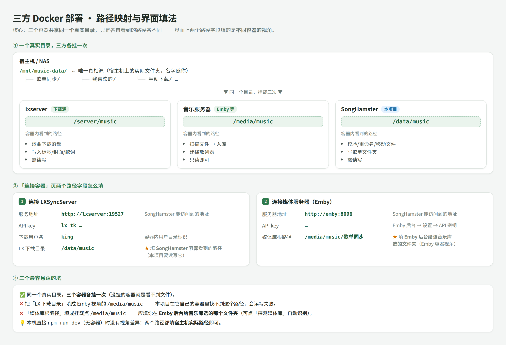

# SongFerry — LX 歌单同步入库音乐媒体库

[](https://hub.docker.com/r/libremk66/songferry)
[](https://hub.docker.com/r/libremk66/songferry)
[](LICENSE)

将 [LX Music Sync Server](https://github.com/XCQ0607/lxserver) 的歌单（"我喜欢的"、自建歌单）与榜单订阅**自动下载**（完整标签/封面/歌词）并同步进音乐媒体库与播放列表。

支持 **Emby / Navidrome / Jellyfin / 道理鱼 / Subsonic（飞牛等）** 五种媒体服务器，在「连接容器」页用选项卡切换同步目标。

> ⚠️ 本项目只用于同步**你已持有/自有的音乐**。请确保使用合法来源的音乐资源，使用者自行承担相关责任。

## 使用场景

用 [LX Music](https://github.com/lyswhut/lx-music-desktop)（落雪音乐）在**安卓 / 电脑端**听歌收藏 →
数据经 **LX Sync Server**（lxserver）同步 →
本项目把你在落雪里收藏/建立的歌单**自动下载并同步进 Emby** →
用 **Emby** 统一管理自建音乐库（多端播放、车载/客厅投屏、元数据与播放列表管理）。

```
落雪音乐（安卓/桌面）听歌、收藏歌单
        │ 歌单数据同步
        ▼
LX Sync Server（歌单数据同步服务）
        │ SongFerry 拉取歌单 → LX 下载（标签/封面/歌词）→ 整理入库
        ▼
本项目 SongFerry（自动同步 / 洗版 / 查重）
        │
        ▼
Emby 自建音乐库 + 播放列表（家庭多端播放）
```

一句话：**在落雪里"喜欢"的每首歌，最终都会以无损 + 完整标签的形式出现在你的 Emby 音乐库里。**
## 功能一览

- **歌单同步**：增量（只增不减）/ 镜像（增删同步、向 LX 看齐）两种模式；每歌单独立 cron 定时；全局单飞 + 批量下载保护（请求节流）防音源限流
- **LX 端删除的三级处理**（镜像模式）：① 仅从歌单移除、保留文件（默认）② 移除 + 删除文件（先进回收站可恢复）③ 移入归档歌单（统一归档 / 按来源 `[歌单名]归档` / 任选已有歌单）
- **监听同步**：LX 出现新歌单自动建任务并同步 —— 完全模式（可勾选是否纳入现有歌单，含基线快照 + 忽略列表防循环）或条件模式（按歌单名/关键词规则命中）
- **榜单订阅**：订阅 QQ/酷我/网易云/酷狗/咪咕/百度 榜单，定时拉榜 → 新上榜自动下载入播放列表；可选镜像跟随榜单（跌出即按同一套三级策略处理）
- **音质链**：128k → 192k → 320k → FLAC → FLAC 24-Bit → Hi-Res → Atmos → Atmos Plus → 臻品母带（9 档勾选，按歌曲实际可用档自动尝试；真实位深/采样率/码率实测校验防虚标，Atmos 容器嗅探防换壳）
- **进度与历史**：实时进度显示"第几首/共几首 · 当前阶段 · 当前歌曲 · 成败计数"；历史按 歌单同步 / 榜单订阅 分标签，批次可展开明细、失败可重试
- **日志**：按天落盘 `data/logs/`，界面支持级别筛选（INFO/WARN/ERROR）与关键字搜索
- **删除安全缓冲（回收站）**：删除 = 先移入 `<downloadRoot>/.songferry-trash` 可恢复，**彻底删除**才物理删文件
- **安全默认**：源歌单/榜单拉取异常（而非真空）时**停用任务并告警，绝不清空目标**；归档目标被删则降级为"保留文件"，不静默重建
- **账号认证**：登录保护，scrypt 密码哈希，持久会话
- **曲库管理（界面暂时收起）**：安全洗版 / 查重清理 —— 代码与路由保留，需要时一行注解恢复

## 界面

| 页面 | 作用 |
|---|---|
| 连接容器 | LX 下载源 + 媒体服务器（选项卡切换类型；「确定」= 保存 → 测连接 → 探测媒体库 → 全部通过才设为同步目标） |
| 歌单同步 | 两标签：创建同步任务 / 监听同步；下方任务表（模式、删除策略、归档目标、cron、启停） |
| 榜单订阅 | 榜单浏览 + 新建订阅 + 订阅列表（模式与跌出处理可在行内编辑） |
| 下载选项 | 音质偏好 / 文件命名 / 写入文件信息 / 下载行为 / 批量下载保护 |
| 进度历史 | 顶部实时进度（正在跑的任务）+ 歌单同步 / 榜单订阅历史标签 + 回收站 |
| 日志 | 落盘日志，级别筛选 + 关键字搜索 |
| 设置 | 通用（日志保留天数）、账号安全、运行信息 |

## 目录结构

```
data/config.yaml      配置（界面设置保存于此，含密钥，勿提交）
data/songferry.db     SQLite 数据库（历史/状态/会话）
src/                  源码（Node.js ≥22 + TypeScript，前端 htmx 无构建）
static/               自绘图标与前端静态资源
Dockerfile            多阶段构建镜像（node:22-slim 运行）
config.example.yaml   配置模板（带注释，不含密钥）
docs/                 部署指南（路径映射详解 / 同步重设计规格 / UI 规范）
data/logs/            按天落盘的运行日志（界面「日志」页数据源）
docker-compose.example.yml  部署路径约定模板
```

## 快速开始（Docker 部署）

镜像：**`libremk66/songferry:latest`**（Docker Hub）。运行目录 `/app`，配置与数据库在 `/app/data`（首次启动自动生成默认 config.yaml）。



> ☝️ 三方（lxserver / 媒体服务器 / SongFerry）**共享同一个音乐目录**，只是各容器看到的路径名不同；
> 「连接容器」页两个路径字段该填哪个视角、三个常见坑，都在图里。完整部署说明见 [docs/path-mapping.md](docs/path-mapping.md)。

### 方式一：docker run（最简）

```bash
docker run -d --name songferry \
  --restart unless-stopped \
  -p 8935:8935 \
  -v /你的路径/music-data:/data/music \
  -v /你的路径/songferry-data:/app/data \
  -e SONGFERRY_AUTH_USER=admin \
  -e SONGFERRY_AUTH_PASSWORD=改成你的密码 \
  libremk66/songferry:latest
```

打开 `http://<nas>:8935` → 用上面的账号登录 → 「连接容器」页填 LX 与媒体服务器信息。

> `-v /你的路径/music-data:/data/music` 就是**与 lxserver、媒体服务器共享的同一个目录**（见文末示意图）。
> 连接信息也可以直接用环境变量注入，省去界面填写：
> `-e SONGFERRY_LXSERVER_URL=http://lxserver:19527 -e SONGFERRY_LXSERVER_KEY=lx_tk_xxx -e SONGFERRY_EMBY_URL=http://emby:8096 -e SONGFERRY_EMBY_KEY=xxx`

### 方式二：docker compose（推荐）

```yaml
services:
  songferry:
    image: libremk66/songferry:latest
    container_name: songferry
    restart: unless-stopped
    ports:
      - "8935:8935"
    environment:
      SONGFERRY_AUTH_USER: admin            # 首次启动自动启用认证
      SONGFERRY_AUTH_PASSWORD: change-me    # 一定要改
      SONGFERRY_LXSERVER_URL: http://lxserver:19527
      SONGFERRY_LXSERVER_KEY: <lx 用户 token>
      SONGFERRY_EMBY_URL: http://emby:8096
      SONGFERRY_EMBY_KEY: <emby api key>
    volumes:
      - ./music-data:/data/music            # ← 与 lxserver / Emby 共享的同一目录
      - ./songferry-data:/app/data          #   配置(config.yaml) + 数据库

  # lxserver、Emby 两个服务的完整写法（含端口/卷约定）见
  # docker-compose.example.yml —— 三方把同一个 ./music-data 各挂一次即可
```

### 方式三：自己构建（可选）

```bash
docker build -t songferry .        # 本仓库根目录
docker run -d --name songferry -p 8935:8935 \
  -v /你的路径/music-data:/data/music -v /你的路径/songferry-data:/app/data songferry
```

> better-sqlite3 原生模块在构建阶段编译（自动装 python3/make/g++）。

## 开发运行

```bash
npm ci
npm run dev        # http://127.0.0.1:8935
npm run build      # tsc 编译
npm start          # node dist/server.js
```

环境变量（docker secrets 注入用）：
`SONGFERRY_AUTH_USER` / `SONGFERRY_AUTH_PASSWORD` / `SONGFERRY_LXSERVER_URL` / `SONGFERRY_LXSERVER_KEY` / `SONGFERRY_EMBY_URL` / `SONGFERRY_EMBY_KEY` / `SONGFERRY_PORT`

## Roadmap

- [x] Emby 媒体库 + 播放列表同步
- [x] **Navidrome / Jellyfin / 道理鱼 / Subsonic 适配**（连接容器页切换同步目标）
- [x] 安全洗版 / 查重清理 / 回收站
- [x] 监听同步 / 榜单订阅 / 镜像 + 三级删除策略（含归档）
- [ ] 曲库管理（洗版 / 查重）界面恢复开放
- [ ] 通知渠道（飞书 webhook，界面已预留）
- [ ] GitHub Actions 自动构建镜像（ghcr.io）

## 致谢与借鉴

- [XCQ0607/lxserver](https://github.com/XCQ0607/lxserver) — LX Music 数据同步服务端（下载引擎）
- [NeoHeee/songloft-plugin-lxbridge](https://github.com/NeoHeee/songloft-plugin-lxbridge) — 安全洗版与匹配分算法设计参考

## License

[Apache-2.0](LICENSE)
